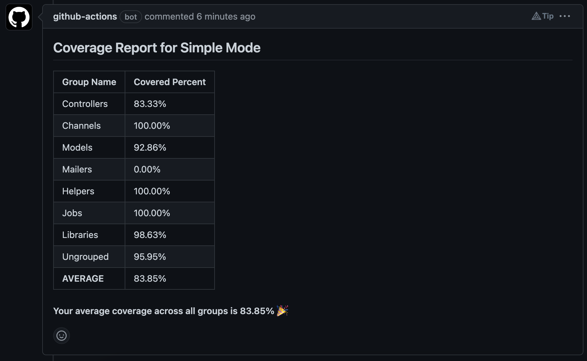
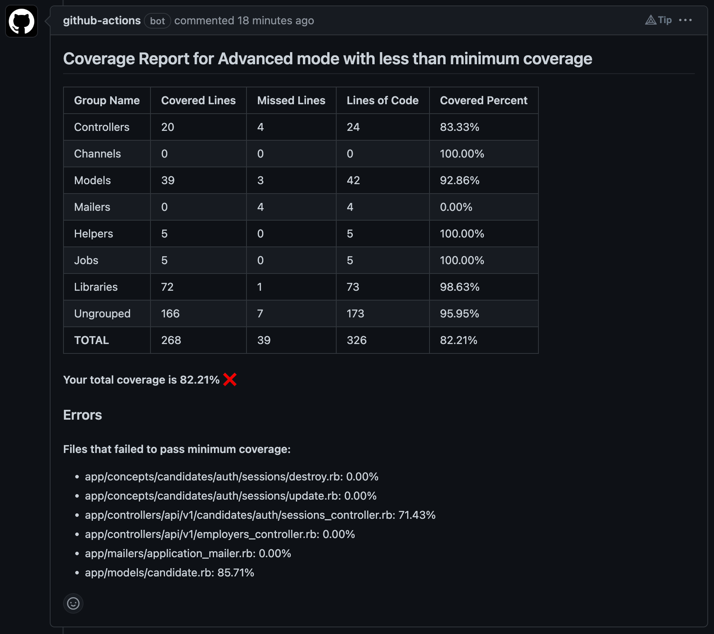

# SimpleCov Reporter

A GitHub Action that reports SimpleCov Coverage with Group details in the PR's comment. The action works only with `pull_request` event.



## Usage:

###### NOTE: This works only if your SimpleCov is set up to show group metrics. If you are using `rails` or any supported framework, you might not have to do anything. If otherwise, you'll have to do some digging to set up group-based metrics. The examples generated here are using a Rails application.

This action works right out of the box with SimpleCov's recommended JSON formatter, `simplecov_json_formatter`.
This is what I call the 'Simple Mode' (which is shown in the above example).

To enable some advanced options (which I call the 'Advanced Mode'), you can use my fork of `simplecov_json_formatter` found [here](https://www.github.com/shettytejas/simplecov_json_formatter).

```ruby
# ~ Gemfile

gem 'simplecov_json_formatter', github: 'shettytejas/simplecov_json_formatter', require: false
```

The 'Advanced Mode' has the ability to provide more details\*.




###### To make the failing file errors and total coverage icon indicators work, you need to set up the SimpleCov config for `SimpleCov.minimum_coverage` and `SimpleCov.minimum_coverage_by_file` to check coverage by `line`. Branch metrics are not supported as of now!

###### Example Config (In your Ruby application):

```ruby
SimpleCov.minimum_coverage 90 # or SimpleCov.minimum_coverage {line: 90}
SimpleCov.minimum_coverage_by_file 90 # or SimpleCov.minimum_coverage_by_file {line: 90}
```

### Inputs

- `token` - The GITHUB_TOKEN secret. (required)
- `result-path` - Path to last_run json file. (default: `coverage/coverage.json`)
- `working-directory` - Directory path for searching the result-path (default: `.`)
- `title` - Subject line for the MR Comment (default: `SimpleCov Report 🎉`)

## Example

To use this in your workflow, you add this the following way:

```yaml
name: CI Workflow
on:
  pull_request:

jobs:
  build:
    steps:
      - name: Rspec
        run: bundle exec rspec
      - name: Simplecov Report
        uses: shettytejas/simplecov-reporter@v1
        with:
          # More options as given above.
          token: ${{ secrets.GITHUB_TOKEN }}
```

## Future Scope (v2 support)

- Option to enforce minimum coverages (i.e failing jobs based on coverage status).
- Options for users to give custom icons for success and failures?
- Branch Metrics (This looks tough)
- ... (more?)

## Development

1. Checkout the code and make a PR against `master` branch.
2. Make sure to add test cases (with new .json files) for the changes added.
3. Make sure to reference it in the `unit-test.yml` workflow.

## Special Thanks

This action has been heavily inspired by `pi-chan/simplecov-report-group-action`, so a huge shoutout to it's creator 😄
